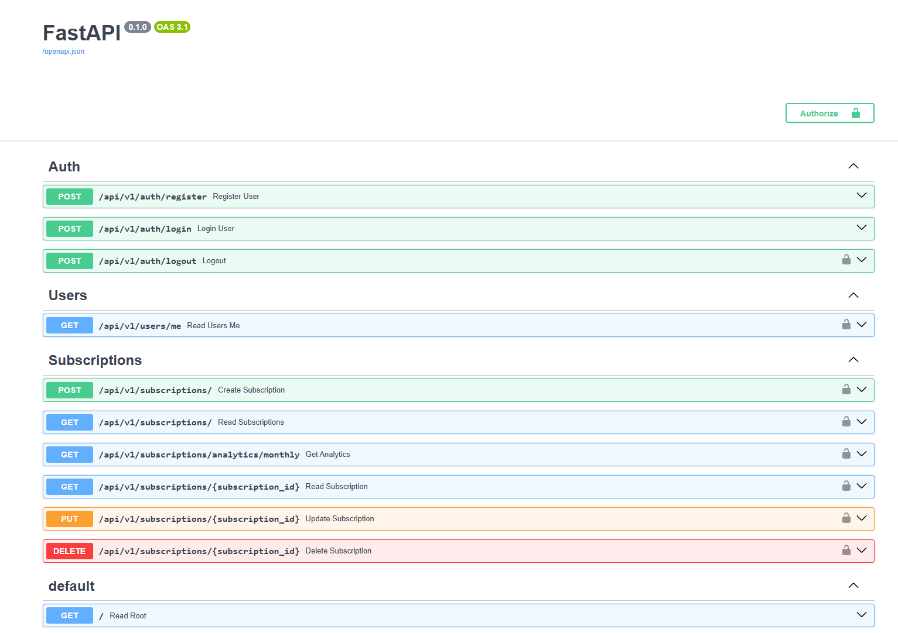
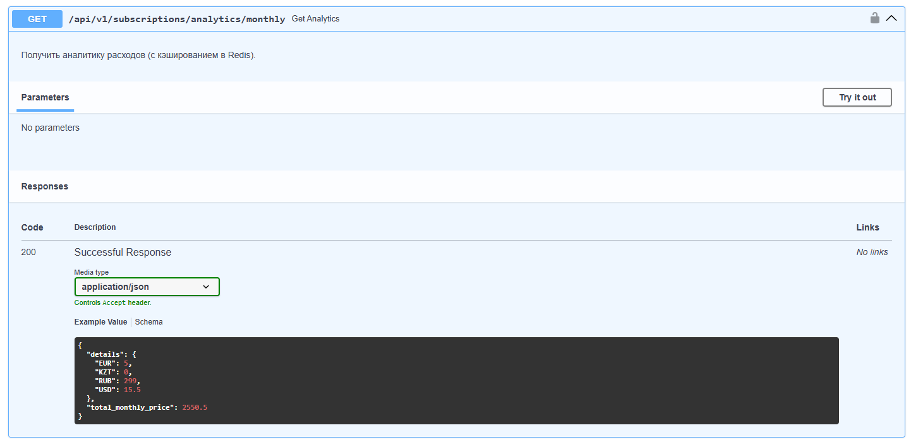

# 🚀 Smart Subscription Manager API


A powerful and scalable Async REST API designed to track personal subscriptions, calculate monthly expenses with multi-currency support, and analyze spending habits.

Built with **Clean Architecture** principles, focusing on scalability, testability, and performance.

---

## 📸 Screenshots



*The interactive API documentation (Swagger UI)*



*Real-time analytics with currency conversion and caching*

---

## ✨ Features

*   **🔐 Secure Authentication:** Full JWT flow (Register, Login) with **Redis Blacklist** strategy for secure Logout.
*   **💳 Subscription Management:** CRUD operations for subscriptions (Netflix, Spotify, etc.) with strict validation.
*   **💰 Smart Analytics:** Calculates total monthly expenses. Supports **multi-currency** (USD, EUR, RUB, KZT) with automatic conversion to a base currency.
*   **⚡ High Performance:** Implements **Redis Cache-Aside pattern**. Heavy analytical queries are cached and instantly invalidated upon data changes.
*   **🛡️ Security First:** Protection against **IDOR** (Insecure Direct Object References) — users can only access their own data.
*   **🏗️ Solid Architecture:** Based on **Repository Pattern** and **Service Layer** with Dependency Injection.
*   **🧪 robust Testing:** 90%+ Code Coverage using **Pytest** and **Testcontainers** (Real Postgres & Redis in tests).

---

## 🛠️ Tech Stack

*   **Framework:** [FastAPI](https://fastapi.tiangolo.com/) (Python 3.13)
*   **Database:** [PostgreSQL](https://www.postgresql.org/) (Async `asyncpg`)
*   **ORM:** [SQLAlchemy 2.0](https://www.sqlalchemy.org/)
*   **Migrations:** [Alembic](https://alembic.sqlalchemy.org/)
*   **Caching:** [Redis](https://redis.io/)
*   **Validation:** [Pydantic V2](https://docs.pydantic.dev/)
*   **Containerization:** Docker & Docker Compose (Alpine based images)
*   **Testing:** Pytest, Testcontainers, HttpX

---

## 🚀 Getting Started

### Prerequisites

*   Docker & Docker Compose

### Run with Docker (Recommended)

1.  **Clone the repository**
    ```bash
    git clone https://github.com/your-username/smart-subscription-manager.git
    cd smart-subscription-manager
    ```

2.  **Create .env file**
    ```bash
    # Linux/Mac
    cp .env.example .env
    # Windows
    copy .env.example .env
    ```

3.  **Build and Run**
    ```bash
    docker-compose up -d --build
    ```

4.  **Access the API**
    *   Swagger UI: http://localhost:8000/docs
    *   PgAdmin: http://localhost:8080

---

## 🐢 Local Development (Without Docker for App)

If you want to run Python locally for debugging:

1.  **Start Infrastructure (DB & Redis)**
    ```bash
    docker-compose up -d postgres redis
    ```

2.  **Install Dependencies**
    ```bash
    python -m venv venv
    source venv/bin/activate  # or venv\Scripts\activate on Windows
    pip install -r requirements.txt
    ```

3.  **Apply Migrations**
    ```bash
    alembic upgrade head
    ```

4.  **Run Server**
    ```bash
    uvicorn app.main:app --reload
    ```

---

## 🧪 Testing

This project uses **Testcontainers** to spin up real database instances for integration tests.

```bash
# Run all tests
pytest
```

```bash
# Run with coverage report
pytest --cov=app --cov-report=html
```

## 📂 Project Structure

The project follows a **Layered Architecture** pattern, ensuring separation of concerns and scalability:

```text
smart_subscription_manager/
├── 📂 alembic/             # Database migrations (managed by Alembic)
├── 📂 app/                 # Main application source code
│   ├── 📂 api/             # Presentation Layer
│   │   ├── 📂 v1/          # API Versioning (endpoints)
│   │   └── deps.py         # Dependency Injection setup (DB, Redis, User)
│   │
│   ├── 📂 core/            # Core Application Configuration
│   │   ├── config.py       # Pydantic Settings (loads .env)
│   │   ├── security.py     # JWT handling and password hashing
│   │   └── exceptions.py   # Custom Exception classes
│   │
│   ├── 📂 db/              # Database Infrastructure
│   │   └── session.py      # Async Engine and Session maker
│   │
│   ├── 📂 models/          # Database Layer (SQLAlchemy ORM Models)
│   │   ├── user.py
│   │   └── subscription.py
│   │
│   ├── 📂 repositories/    # Data Access Layer (CRUD operations, raw SQL)
│   │   ├── user_repository.py
│   │   └── subscription_repository.py
│   │
│   ├── 📂 schemas/         # Data Transfer Objects (Pydantic Models)
│   │   ├── token.py
│   │   ├── user.py
│   │   └── subscription.py
│   │
│   └── 📂 services/        # Business Logic Layer (Orchestration, Caching)
│       ├── auth_service.py
│       └── subscription_service.py
│
├── 📂 tests/               # Automated Tests
│   ├── 📂 integration/     # API tests with real DB/Redis via Testcontainers
│   ├── 📂 unit/            # Isolated logic tests with Mocks
│   └── conftest.py         # Pytest fixtures and Docker setup
│
├── .env.example            # Example environment variables
├── .gitignore              # Files to ignore in Git
├── docker-compose.yaml     # Docker orchestration config
├── Dockerfile              # Image build instruction
├── entrypoint.sh           # Startup script (Apply migrations -> Start app)
├── pytest.ini              # Testing configuration
└── requirements.txt        # Python dependencies
```

## 🔑 Environment Variables

To run this project, you will need to add a `.env` file to the root directory.
You can copy the example file:

```bash
cp .env.example .env
```

| Variable | Description | Default Value |
| :--- | :--- | :--- |
| **Database Configuration** | | |
| `POSTGRES_USER` | Database username | `admin` |
| `POSTGRES_PASSWORD` | Database password | `qwerty` |
| `POSTGRES_DB` | Database name | `subs_manager_db` |
| `POSTGRES_PORT` | Database port | `5432` |
| `POSTGRES_HOST` | Database host | `localhost` (use `postgres` inside Docker) |
| **Redis Configuration** | | |
| `REDIS_HOST` | Redis host | `localhost` (use `redis` inside Docker) |
| `REDIS_PORT` | Redis port | `6379` |
| **Security (JWT)** | | |
| `SECRET_KEY` | Secret string for hashing | `YOU_SECRET_KEY_CHANGE` |
| `ALGORITHM` | Encryption algorithm | `HS256` |
| `ACCESS_TOKEN_EXPIRE_MINUTES` | Token lifetime (minutes) | `30` |
| **PgAdmin (Optional)** | | |
| `PGADMIN_DEFAULT_EMAIL` | Admin email for UI | `admin@email.com` |
| `PGADMIN_DEFAULT_PASSWORD` | Admin password for UI | `123Admin` |

## 📝 License

This project is licensed under the [MIT License](LICENSE).